# 🧠 Voice-Only Omani Arabic Mental Health Chatbot

**المساعد النفسي العماني الذكي | Intelligent Omani Mental Health Assistant**

A comprehensive mental health support chatbot that communicates exclusively through voice in Omani Arabic dialect, providing culturally sensitive, therapeutic-grade conversations with real-time speech processing capabilities.

## 🎯 Project Overview

This application provides mental health support through voice-only interactions in Omani Arabic, featuring:
- **Real-time voice processing** with <20 second response times
- **Cultural authenticity** with Omani Arabic dialect and Islamic counseling principles
- **Dual-model AI system** (GPT-4o + Claude) for safety and cultural sensitivity
- **Crisis detection** with automatic emergency support
- **Privacy-first** design with no conversation data storage

## 🏗️ System Architecture

### Main System Flow

```mermaid
graph TB
    A[👤 User] --> B[🎤 Voice Input]
    B --> C[📱 Streamlit App<br/>app.py]
    C --> D[🧠 Mental Health Bot<br/>mental_health_bot.py]
    
    D --> E[🎙️ Speech Service<br/>speech_service.py]
    E --> F[🔊 Whisper STT<br/>OpenAI API]
    F --> G[📝 Arabic Text]
    
    G --> H[🤖 AI Service<br/>ai_service.py]
    H --> I[🧭 GPT-4o<br/>Primary Response]
    H --> J[🛡️ Claude Opus<br/>Cultural Validation]
    
    K[⚙️ Config<br/>config.py] --> D
    K --> E
    K --> H
    
    I --> L[📋 Crisis Detection]
    J --> L
    L --> M[🔄 Response Validation]
    
    M --> N[🔊 Azure TTS<br/>Omani Arabic Voice]
    N --> O[🎵 Audio Response]
    O --> C
    C --> P[🔊 Audio Playback]
    P --> A
    
    Q[🚨 Crisis Alert] --> R[📞 Emergency Contacts<br/>9999, 24673000]
    L --> Q
    
    S[📊 Session Management] --> D
    T[🛠️ System Testing] --> D
    
    style A fill:#e1f5fe
    style C fill:#f3e5f5
    style D fill:#e8f5e8
    style H fill:#fff3e0
    style E fill:#fce4ec
    style K fill:#f1f8e9
    style Q fill:#ffebee
    style R fill:#ffcdd2
```


### Voice Processing Pipeline

```mermaid
flowchart TD
    A[🎤 User Speaks<br/>Omani Arabic] --> B[📹 Audio Recording<br/>streamlit-mic-recorder]
    B --> C[🔍 Audio Validation<br/>Min 1000 bytes]
    
    C --> D{📏 Audio Size<br/>Check}
    D -->|Too Small| E[❌ Error: No Speech<br/>Duration & Volume Info]
    D -->|Valid| F[⬆️ Upload to Whisper<br/>OpenAI API]
    
    F --> G[🔊 Speech-to-Text<br/>Arabic Recognition]
    G --> H{📝 Text Valid?}
    H -->|Empty| I[❌ Error: No Speech<br/>+ Audio Analysis]
    H -->|Valid| J[✅ Arabic Text<br/>Extracted]
    
    J --> K[🤖 AI Processing<br/>GPT-4o + Claude]
    K --> L[🔍 Crisis Detection<br/>Arabic & Mixed Keywords]
    
    L --> M{🚨 Crisis<br/>Detected?}
    M -->|Yes| N[🚨 Emergency Response<br/>+ Crisis Resources]
    M -->|No| O[💬 Normal Response<br/>Cultural Context]
    
    N --> P[🔊 Azure TTS<br/>Omani Voice Synthesis]
    O --> P
    
    P --> Q[🎵 Audio Response<br/>ar-OM-AyshaNeural]
    Q --> R[📱 Streamlit Playback<br/>User Interface]
    R --> S[👤 User Hears<br/>Response]
    
    T[📊 Performance Metrics<br/>Response Time: <20s] --> U[📈 Session Stats<br/>Conversation Count]
    K --> T
    
    V[🔒 Privacy Protection<br/>No Data Storage] --> W[🗑️ Auto-Cleanup<br/>Session End]
    S --> V
    
    style A fill:#e3f2fd
    style G fill:#f3e5f5
    style K fill:#e8f5e8
    style M fill:#fff3e0
    style N fill:#ffebee
    style P fill:#fce4ec
    style T fill:#f1f8e9
    style V fill:#e0f2f1
```


### AI Service Decision Flow

```mermaid
flowchart TD
    A[📝 User Message<br/>Arabic/Mixed Text] --> B[🔍 Code-Switching<br/>Detection]
    B --> C[🚨 Crisis Keywords<br/>Analysis]
    
    C --> D{🆘 Crisis<br/>Detected?}
    D -->|Yes| E[🚨 Crisis Mode<br/>Enhanced Prompts]
    D -->|No| F[💬 Normal Mode<br/>Therapeutic Context]
    
    E --> G[🤖 GPT-4o Primary<br/>Crisis Response]
    F --> H[🤖 GPT-4o Primary<br/>Normal Response]
    
    G --> I[🛡️ Claude Validation<br/>Crisis Safety Check]
    H --> J[🛡️ Claude Validation<br/>Cultural Sensitivity]
    
    I --> K{✅ Claude<br/>Validation?}
    J --> L{✅ Claude<br/>Validation?}
    
    K -->|Pass| M[✅ Final Crisis Response<br/>+ Emergency Resources]
    K -->|Fail| N[🔄 Claude Override<br/>Safer Response]
    
    L -->|Pass| O[✅ Final Normal Response<br/>+ Cultural Context]
    L -->|Fail| P[🔄 Claude Override<br/>More Appropriate]
    
    M --> Q[📋 Emergency Contacts<br/>Added to Response]
    N --> Q
    O --> R[🕌 Cultural Enhancements<br/>Islamic Context]
    P --> R
    
    Q --> S[📊 Crisis Logging<br/>Session Statistics]
    R --> T[📈 Normal Logging<br/>Response Metrics]
    
    S --> U[🔊 TTS Processing<br/>Urgent Voice Tone]
    T --> V[🔊 TTS Processing<br/>Calm Voice Tone]
    
    U --> W[🎵 Audio Response<br/>With Crisis Support]
    V --> X[🎵 Audio Response<br/>With Therapeutic Guidance]
    
    Y[⚙️ Configuration] --> Z[🌍 Cultural Settings<br/>Gulf Arab Context]
    Y --> AA[🎭 Therapeutic Approach<br/>CBT + Islamic]
    Y --> BB[🗣️ Voice Settings<br/>Omani Arabic Neural]
    
    Z --> H
    AA --> H
    BB --> V
    BB --> U
    
    style A fill:#e3f2fd
    style C fill:#fff3e0
    style D fill:#ffebee
    style G fill:#f3e5f5
    style I fill:#e8f5e8
    style Q fill:#ffcdd2
    style Y fill:#f1f8e9
    style W fill:#fce4ec
    style X fill:#e1f5fe
```


## 📁 Project Structure

```
Omani_elileAI/
├── app.py                    # Main Streamlit application & UI
├── mental_health_bot.py      # Core bot logic & session management
├── ai_service.py            # GPT-4o + Claude dual-model AI
├── speech_service.py        # Whisper STT + Azure TTS
├── config.py               # Configuration & cultural settings
├── requirements.txt        # Python dependencies
├── startup.sh             # Azure deployment script
├── README.md              # This documentation
└── .github/workflows/     # GitHub Actions for deployment
```

### Core Components

#### 🧠 Mental Health Bot (`mental_health_bot.py`)
- **Main coordination** between all services
- **Session management** and statistics tracking
- **Crisis detection** and intervention protocols
- **Performance monitoring** and system health checks

#### 🤖 AI Service (`ai_service.py`)
- **GPT-4o primary model** for conversational responses
- **Claude Opus validation** for cultural sensitivity
- **Crisis keyword detection** in Arabic, English, and mixed language
- **Code-switching support** for natural Arabic-English mixing

#### 🎙️ Speech Service (`speech_service.py`)
- **Whisper STT** using OpenAI API for Arabic speech recognition
- **Azure Neural TTS** with authentic Omani Arabic voices
- **Audio processing** and format conversion
- **Performance optimization** for <20 second response times

#### 📱 Streamlit App (`app.py`)
- **Voice recording interface** using streamlit-mic-recorder
- **Real-time conversation display** with audio playback
- **Session statistics** and system status monitoring
- **Crisis alert handling** with emergency contact display

#### ⚙️ Configuration (`config.py`)
- **Environment-based settings** with Pydantic validation
- **Cultural context parameters** for Gulf Arab traditions
- **Crisis keywords** in Arabic, English, and mixed language
- **Therapeutic approaches** adapted for Islamic counseling

## 🚀 Quick Start

### Prerequisites
- Python 3.8+
- OpenAI API Key (for Whisper STT and GPT-4o)
- Anthropic API Key (for Claude validation)
- Azure Speech Services Key (for TTS)
- Microphone access for voice input

### Installation

1. **Clone the repository**
```bash
git clone <repository-url>
cd Omani_elileAI
```

2. **Install dependencies**
```bash
pip install -r requirements.txt
```

3. **Set environment variables**
```bash
export OPENAI_API_KEY="your_openai_api_key"
export ANTHROPIC_API_KEY="your_anthropic_api_key"
export AZURE_SPEECH_KEY="your_azure_speech_key"
export AZURE_SPEECH_REGION="eastus"
```

4. **Run the application**
```bash
streamlit run app.py
```

## 🌟 Key Features

### 🎤 Voice-Only Interface
- **Real-time speech processing** with <20 second latency
- **Omani Arabic dialect** recognition and synthesis
- **Audio quality optimization** for clear communication
- **Microphone integration** with streamlit-mic-recorder

### 🤖 Dual-Model AI System
- **GPT-4o primary responses** for natural conversation
- **Claude Opus cultural validation** for appropriateness
- **Smart fallback mechanisms** for service availability
- **Crisis detection algorithms** with emergency protocols

### 🕌 Cultural Integration
- **Islamic counseling principles** integrated into responses
- **Gulf Arab cultural context** understanding
- **Code-switching support** for Arabic-English mixing
- **Traditional wisdom** incorporation in therapeutic guidance

### 🆘 Safety & Crisis Support
- **Automatic crisis detection** in multiple languages
- **Emergency contact integration** (Police: 9999, Mental Health: 24673000)
- **Professional referral protocols** for severe cases
- **Privacy-first architecture** with no data retention

## 🔧 Configuration Options

### Environment Variables
```bash
# Required API Keys
OPENAI_API_KEY=your_openai_api_key
ANTHROPIC_API_KEY=your_anthropic_api_key
AZURE_SPEECH_KEY=your_azure_speech_key
AZURE_SPEECH_REGION=eastus

# Optional Application Settings
MAX_RESPONSE_TIME=15
ENABLE_CRISIS_DETECTION=true
PRIMARY_LANGUAGE=ar-OM
CULTURAL_CONTEXT=gulf_arab
THERAPEUTIC_APPROACH=cbt_islamic

# Voice Configuration
TTS_VOICE_FEMALE=ar-OM-AyshaNeural
TTS_VOICE_MALE=ar-OM-AbdullahNeural
WHISPER_MODEL=base
```

### Cultural Settings
- **Primary Language**: ar-OM (Omani Arabic)
- **Fallback Language**: ar-SA (Saudi Arabic)
- **Cultural Context**: gulf_arab
- **Therapeutic Approach**: cbt_islamic (CBT + Islamic counseling)

## 📈 Performance Targets

### ⚡ Response Time Metrics
- **Total Response Time**: <20 seconds
- **Speech-to-Text**: <3 seconds
- **AI Processing**: <10 seconds
- **Text-to-Speech**: <5 seconds
- **Audio Playback**: <2 seconds

### 🎯 Quality Standards
- **Speech Recognition Accuracy**: >95% for Omani Arabic
- **Crisis Detection Sensitivity**: <1% false positives
- **Cultural Appropriateness**: Expert-validated responses
- **User Experience**: Therapeutic-grade conversation quality

## 🚀 Deployment

### Azure App Service (Production)

The application is configured for deployment on Azure App Service using the included `startup.sh` script and GitHub Actions workflow.

#### Deployment Steps:
1. **Create Azure resources**
2. **Configure environment variables** in Azure portal
3. **Deploy using GitHub Actions** (automated on push to main)

### Local Development
```bash
# Install dependencies
pip install -r requirements.txt

# Set environment variables
export OPENAI_API_KEY="your_key"
export ANTHROPIC_API_KEY="your_key"
export AZURE_SPEECH_KEY="your_key"

# Run locally
streamlit run app.py
```

## 🔒 Privacy & Security

### Data Protection
- **No conversation storage** - all data cleared after session
- **Encrypted API communication** - TLS 1.3 for all external calls
- **Local processing** - minimal cloud data transmission
- **Session isolation** - unique IDs with automatic cleanup

### Compliance
- **HIPAA-ready architecture** for healthcare data protection
- **Islamic ethics compliance** in counseling approaches
- **Regional privacy laws** adherence for Oman
- **Professional standards** aligned with licensed mental health practices

## 🧪 Testing & Validation

### System Health Check
```bash
# Test all system components
streamlit run app.py
# Click "Test System" in sidebar
```

### Manual Testing Scenarios
1. **General anxiety** conversations in Omani Arabic
2. **Family relationship** discussions with cultural context
3. **Work stress** scenarios with Islamic counseling
4. **Crisis situations** with emergency protocol activation
5. **Code-switching** conversations mixing Arabic and English

### Performance Monitoring
- **Real-time response time** tracking
- **Session statistics** and conversation counts
- **Crisis detection** logging and validation
- **System health** continuous monitoring

## 🤝 Contributing

### Development Guidelines
1. **Cultural sensitivity** must be maintained in all contributions
2. **Mental health standards** - therapeutic-grade quality required
3. **Privacy first** - no unnecessary data collection
4. **Performance targets** - maintain <20 second response times
5. **Testing required** - validate all changes with real scenarios

### Code Structure
- **Clean architecture** with separated concerns
- **Async processing** for performance optimization
- **Error handling** with graceful degradation
- **Logging** for monitoring and debugging

## 📞 Emergency Support

### Crisis Intervention
When crisis keywords are detected, the system automatically:
- Activates enhanced crisis response protocols
- Provides emergency contact information
- Offers immediate coping strategies
- Logs the interaction for follow-up (with consent)

### Emergency Contacts (Oman)
- **Police**: 9999
- **Mental Health Hotline**: 24673000
- **Ministry of Health**: 24602077

## 🔮 Future Enhancements

### Planned Features
- **Multi-dialect support** for other Gulf Arabic variants
- **Family therapy modes** for group sessions
- **Integration with healthcare providers** for referrals
- **Mobile app development** for better accessibility
- **Advanced analytics** for therapy effectiveness tracking

### Technical Improvements
- **Edge computing** for faster response times
- **Offline mode** for areas with poor connectivity
- **Voice biometrics** for personalized experiences
- **Advanced NLP** for better emotion detection

---

**Built with ❤️ for the Omani community | بُني بحب للمجتمع العماني**

*This project aims to provide accessible, culturally appropriate mental health support through innovative voice technology while respecting Islamic values and Omani traditions.* 