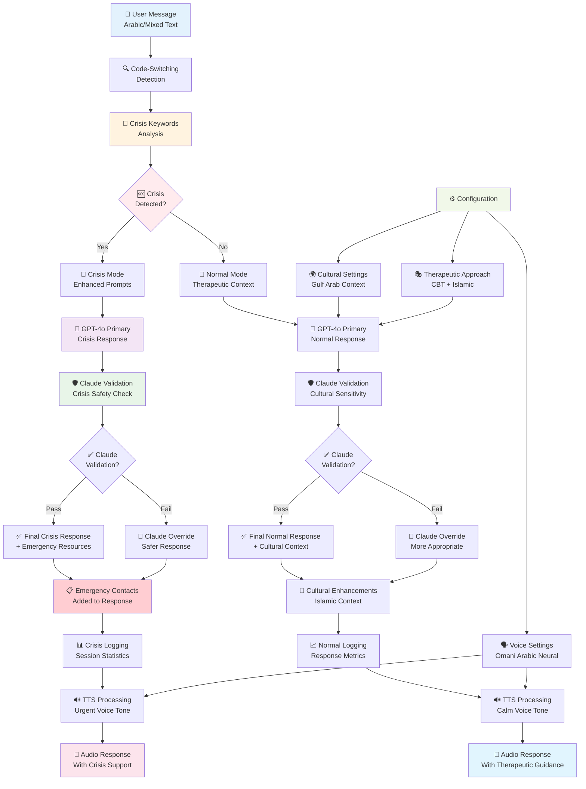

```mermaid
flowchart TD
    A[📝 User Message<br/>Arabic/Mixed Text] --> B[🔍 Code-Switching<br/>Detection]
    B --> C[🚨 Crisis Keywords<br/>Analysis] 
    C --> D{🆘 Crisis<br/>Detected?}
    D -->|Yes| E[🚨 Crisis Mode<br/>Enhanced Prompts]
    D -->|No| F[💬 Normal Mode<br/>Therapeutic Context]
    E --> G[🤖 GPT-4o Primary<br/>Crisis Response]
    F --> H[🤖 GPT-4o Primary<br/>Normal Response]
    G --> I[🛡️ Claude Validation<br/>Crisis Safety Check]
    H --> J[🛡️ Claude Validation<br/>Cultural Sensitivity]
    I --> K{✅ Claude<br/>Validation?}
    J --> L{✅ Claude<br/>Validation?}
    K -->|Pass| M[✅ Final Crisis Response<br/>+ Emergency Resources]
    K -->|Fail| N[🔄 Claude Override<br/>Safer Response]
    L -->|Pass| O[✅ Final Normal Response<br/>+ Cultural Context]
    L -->|Fail| P[🔄 Claude Override<br/>More Appropriate]
    M --> Q[📋 Emergency Contacts<br/>Added to Response]
    N --> Q
    O --> R[🕌 Cultural Enhancements<br/>Islamic Context]
    P --> R
    Q --> S[📊 Crisis Logging<br/>Session Statistics]
    R --> T[📈 Normal Logging<br/>Response Metrics]
    S --> U[🔊 TTS Processing<br/>Urgent Voice Tone]
    T --> V[🔊 TTS Processing<br/>Calm Voice Tone]
    U --> W[🎵 Audio Response<br/>With Crisis Support]
    V --> X[🎵 Audio Response<br/>With Therapeutic Guidance]
    Y[⚙️ Configuration] --> Z[🌍 Cultural Settings<br/>Gulf Arab Context]
    Y --> AA[🎭 Therapeutic Approach<br/>CBT + Islamic]
    Y --> BB[🗣️ Voice Settings<br/>Omani Arabic Neural]
    Z --> H
    AA --> H
    BB --> V
    BB --> U
    style A fill:#e3f2fd
    style C fill:#fff3e0
    style D fill:#ffebee
    style G fill:#f3e5f5
    style I fill:#e8f5e8
    style Q fill:#ffcdd2
    style Y fill:#f1f8e9
    style W fill:#fce4ec
    style X fill:#e1f5fe
```
