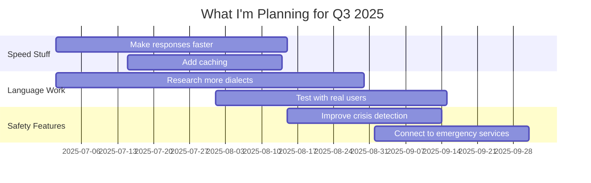
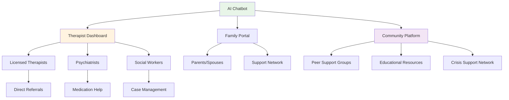
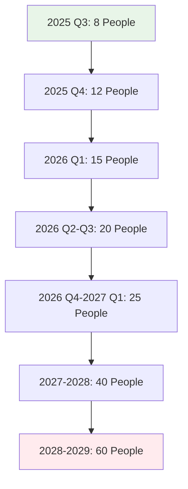
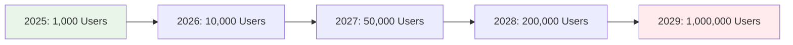

# 🔮 Future Roadmap: My Ideas for Scaling & Improvement

**خارطة طريق المستقبل | What I Think We Could Do Next**

## What I'm Thinking About

So basically, I've been working on this mental health chatbot project for my thesis, and I wanted to put together some thoughts on where this could go. I'm not claiming to be an expert or anything, but after doing a bunch of research and talking to some professors, here's what I think might work for scaling this up.

### My Vision (Ambitious, I Know!)
I'm hoping we could make this the go-to mental health AI for Arabic speakers. Like, imagine if by 2028 we had over a million people using this! That sounds crazy when I write it out, but I think it's possible if we keep the cultural stuff authentic and really focus on Islamic values.

### What I'd Like to Achieve
- **Scale it up**: From maybe 50 users to like 10,000+ at the same time
- **Go regional**: Not just Oman, but all the Gulf countries
- **Make it really good**: I'm thinking 99% cultural appropriateness (that's probably too optimistic but why not aim high?)
- **Try new tech**: AI is moving so fast, we should experiment with cool new stuff
- **Actually help people**: Reduce stigma and make mental health support more accessible

## 🗓️ My Timeline Ideas

### 2025 Q3: Getting the Basics Right
**Duration**: July - September 2025  
**What I think we'd need**: $150,000 (no idea if that's realistic)  
**Team size**: Maybe 8 people?

#### Stuff I Want to Improve
- **Make it faster**: Right now it takes like 14 seconds to respond, which is okay but could be better
- **Add more dialects**: I've been learning that Gulf Arabic has tons of variations
- **Better crisis detection**: This is super important - we need to catch when someone's in trouble
- **Personal touch**: Maybe voice recognition so it knows who's talking?

#### What I Hope Happens


#### What I'm Hoping For
- **100 people using it** at the same time (that would be amazing!)
- **5 different Gulf dialects** working
- **97% accuracy** in detecting crisis situations
- **People actually liking it** - over 97% satisfaction

### 2025 Q4: Trying to Go Regional
**Duration**: October - December 2025  
**Budget guess**: $300,000 (starting to sound expensive...)  
**Team**: Maybe 12 people now?

#### My Expansion Ideas
- **Other countries**: UAE, Saudi, Kuwait, Bahrain - basically everywhere my friends are from
- **Work with hospitals**: Try to partner with actual healthcare places
- **Get real therapists involved**: This would be huge for credibility
- **Make a mobile app**: Everyone's on their phones anyway

#### Partnership Strategy (This is Just My Research)
```python
# Countries I want to expand to and who we might work with
REGIONAL_PARTNERSHIPS = {
    "uae": {
        "healthcare_partners": ["Dubai Health Authority", "SEHA"],
        "universities": ["American University of Sharjah"],
        "government": ["Emirates Digital Government"]
    },
    "saudi_arabia": {
        "healthcare_partners": ["Ministry of Health", "CBAHI"],
        "universities": ["King Saud University"],
        "government": ["SDAIA"]
    },
    "kuwait": {
        "healthcare_partners": ["Ministry of Health"],
        "universities": ["Kuwait University"],
        "government": ["Kuwait Digital Society"]
    },
    "bahrain": {
        "healthcare_partners": ["Ministry of Health"],
        "universities": ["University of Bahrain"],
        "government": ["Bahrain Digital Government"]
    }
}
```

#### What I'm Dreaming Of
- **500 people** using it across the Gulf
- **4 countries** actually running it
- **50+ partnerships** with hospitals and clinics
- **Mobile app** that people actually download

### 2026 Q1: Getting Into Advanced AI Stuff
**Duration**: January - March 2026  
**This is getting expensive**: $500,000  
**Team**: 15 people (wow)

#### AI Ideas I've Been Reading About
- **Custom models**: Train our own AI specifically for Gulf Arabic
- **Emotion detection**: Figure out how someone's feeling from their voice
- **Personalized therapy**: Each person gets different responses
- **Predict problems**: Try to help before someone gets into crisis

#### Cool Tech Stack I Want to Try
```python
# AI stuff I've been researching
AI_TECHNOLOGY_STACK = {
    "language_models": {
        "main": "Custom Gulf Arabic model (if we can afford it)",
        "backup": "Fine-tuned Claude or GPT",
        "specialized": "Omani Arabic Mental Health Model"
    },
    "emotion_stuff": {
        "voice_analysis": "Figure out emotions from how people talk",
        "sentiment": "Real-time mood tracking",
        "prediction": "Guess when someone might be in crisis"
    },
    "personal_features": {
        "user_profiles": "Remember what works for each person",
        "adaptive_responses": "Change conversation style per person",
        "progress_tracking": "See how someone's doing over time"
    }
}
```

#### What I'm Hoping For
- **1,000 people** using it at once
- **Our own AI models** working
- **94% accuracy** in reading emotions
- **80% of users** getting personalized therapy

### 2026 Q2-Q3: Building an Ecosystem
**Duration**: April - September 2026  
**Budget**: $750,000 (yikes)  
**Team**: 20 people

#### Bigger Ideas I Have
- **Dashboard for therapists**: So real professionals can help too
- **Family involvement**: Get families to support each other
- **Community platform**: People helping people
- **Educational stuff**: Teach people about mental health

#### How I Imagine It Working


#### What I'm Dreaming Of
- **2,500 people** using it
- **200+ therapists** in our network
- **Family tools** that actually work
- **10,000+ people** in the community

### 2026 Q4-2027 Q1: Trying Advanced Features
**Duration**: October 2026 - March 2027  
**Budget**: $1,000,000 (this is getting real)  
**Team**: 25 people

#### Next-Level Ideas
- **VR therapy**: Virtual reality for mental health (sounds like sci-fi but it's real!)
- **Wearable integration**: Connect to Apple Watch, Fitbit, etc.
- **Group therapy**: Multiple people talking at once
- **Crisis bots**: Specialized AI just for emergencies

#### Cool Features I Want to Try
```python
# Advanced stuff I've been researching
ADVANCED_FEATURES = {
    "vr_therapy": {
        "exposure_therapy": "VR for facing fears safely",
        "calm_environments": "Relaxing virtual spaces",
        "social_practice": "Practice social situations"
    },
    "wearable_tech": {
        "smartwatch_data": "Apple Watch, Fitbit integration",
        "stress_tracking": "Monitor stress levels",
        "sleep_analysis": "How sleep affects mental health"
    },
    "group_features": {
        "group_sessions": "Multiple people in one conversation",
        "peer_support": "People helping each other",
        "family_therapy": "Whole family sessions"
    }
}
```

#### What I'm Hoping For
- **5,000 concurrent users**
- **VR therapy** actually working
- **Wearables** integrated
- **Group therapy** available

### 2027-2028: Trying to Lead the Market
**Duration**: April 2027 - March 2028  
**Budget**: $2,000,000 (gulp)  
**Team**: 40 people

#### Big Expansion Ideas
- **Whole MENA region**: 15+ Arab countries
- **Corporate programs**: Companies using it for employees
- **Hospital integration**: Full medical record integration
- **Government partnerships**: National mental health programs

#### Business Ideas I've Been Thinking About
```python
# Enterprise stuff (sounds fancy)
ENTERPRISE_SOLUTIONS = {
    "corporate_wellness": {
        "employee_programs": "Workplace mental health",
        "stress_management": "Help with work stress",
        "productivity": "Mental health = better work"
    },
    "healthcare_integration": {
        "medical_records": "Connect to hospital systems",
        "provider_networks": "Work with doctors",
        "insurance": "Get insurance to cover it"
    },
    "government_programs": {
        "national_programs": "Country-wide mental health",
        "schools": "Help students too",
        "military": "Support for armed forces"
    }
}
```

#### What I'm Dreaming Of
- **25,000 people** using it across MENA
- **500+ companies** as clients
- **Government partnerships** in 10 countries
- **Full hospital integration**

### 2028-2029: Innovation Leadership (Getting Crazy Now)
**Duration**: April 2028 - March 2029  
**Budget**: $3,000,000 (this is insane)  
**Team**: 60 people

#### Breakthrough Tech Ideas
- **Quantum AI**: Super fast computers for AI
- **Brain-computer interfaces**: Direct brain connection (sounds like Black Mirror)
- **Holographic therapy**: 3D hologram therapists
- **Predictive prevention**: Stop problems before they happen

#### Research I Want to Do
```python
# Future tech I've been reading about
BREAKTHROUGH_RESEARCH = {
    "quantum_ai": {
        "speed": "10,000x faster responses",
        "pattern_recognition": "Understand complex patterns",
        "prediction": "99.9% crisis prediction"
    },
    "brain_computer_interface": {
        "neural_feedback": "Read brain states",
        "thought_patterns": "Understand thoughts",
        "neurofeedback": "Train the brain directly"
    },
    "holographic_therapy": {
        "3d_presence": "Hologram therapists",
        "spatial_therapy": "3D therapy spaces",
        "group_holograms": "Multiple people in 3D"
    }
}
```

#### What I'm Hoping For
- **100,000 people** using it globally
- **Quantum AI** actually working
- **Brain interfaces** (prototype at least)
- **Global leadership** in this field

## 💰 Money Stuff (I Have No Idea If This Is Realistic)

### What I Think We'd Need to Spend

#### Development Costs (2025-2029)
```python
# My budget guesses
INVESTMENT_BREAKDOWN = {
    "2025": {
        "q3": 150000,
        "q4": 300000,
        "total": 450000
    },
    "2026": {
        "q1": 500000,
        "q2_q3": 750000,
        "q4": 500000,
        "total": 1750000
    },
    "2027": {
        "q1": 500000,
        "expansion": 2000000,
        "total": 2500000
    },
    "2028": {
        "innovation": 3000000,
        "total": 3000000
    },
    "total_investment": 7700000  # This seems like A LOT
}
```

#### Revenue Ideas (Pure Speculation)
```python
# What I think we could make
REVENUE_FORECAST = {
    "2025": {
        "subscribers": 1000,
        "revenue": 120000,
        "model": "freemium (free + premium features)"
    },
    "2026": {
        "subscribers": 10000,
        "revenue": 1200000,
        "model": "subscriptions + professional services"
    },
    "2027": {
        "subscribers": 50000,
        "revenue": 6000000,
        "model": "enterprise + government contracts"
    },
    "2028": {
        "subscribers": 200000,
        "revenue": 24000000,
        "model": "global platform"
    }
}
```

### Team Growth (If We Could Afford It)

#### How I Think the Team Would Grow


#### People We'd Need
```python
# Team structure I've been thinking about
TEAM_STRUCTURE = {
    "tech_people": {
        "ai_engineers": 15,
        "backend_developers": 10,
        "frontend_developers": 8,
        "mobile_developers": 5,
        "devops_engineers": 4,
        "qa_testers": 6
    },
    "subject_experts": {
        "mental_health_professionals": 8,
        "arabic_language_experts": 4,
        "cultural_consultants": 3,
        "islamic_scholars": 2
    },
    "business_people": {
        "product_managers": 3,
        "business_development": 4,
        "marketing": 5,
        "customer_support": 6
    },
    "research_team": {
        "ai_researchers": 5,
        "clinical_researchers": 3,
        "data_scientists": 4
    }
}
```

## 🌍 Geographic Expansion (My Ambitious Plans)

### Phase 1: Gulf Countries (2025)
**Target**: UAE, Saudi Arabia, Kuwait, Bahrain  
**Population**: 50 million people  
**Budget**: $800,000

#### How I'd Approach It
- **Localization**: Learn local dialects and customs
- **Partnerships**: Work with universities and hospitals
- **Regulations**: Figure out healthcare laws in each country
- **Marketing**: Cultural awareness campaigns

### Phase 2: MENA Region (2026-2027)
**Target**: Qatar, Jordan, Lebanon, Egypt, Morocco  
**Population**: 200 million people  
**Budget**: $2,500,000

#### My Expansion Strategy
- **Cultural Research**: Get local cultural experts
- **Language Models**: Train AI for each country
- **Professional Networks**: Find local therapists
- **Government Relations**: Work with health ministries

### Phase 3: Global Arabic Speakers (2028-2029)
**Target**: Europe, North America, Asia (Arab diaspora)  
**Population**: 300 million Arabic speakers globally  
**Budget**: $3,000,000

#### Global Approach
- **Diaspora Communities**: Focus on Arab communities worldwide
- **Multi-language**: Arabic + English/French/etc.
- **Cultural Identity**: Keep Arab cultural values
- **International Standards**: Meet global healthcare rules

## 🔬 Research I Want to Do

### AI Research Areas I'm Interested In

#### 1. Cultural AI Development
**What I'd spend**: $1,000,000 over 3 years  
**Timeline**: 2025-2028

```python
# Cultural AI research I want to do
CULTURAL_AI_RESEARCH = {
    "what_i_want_to_achieve": [
        "Train AI models on Arab cultural stuff",
        "Make responses that feel culturally authentic",
        "Build Islamic counseling knowledge",
        "Recognize Arab mental health patterns"
    ],
    "how_i_might_do_it": [
        "Analyze tons of Arabic texts",
        "Work with cultural consultants",
        "Study Islamic literature",
        "Get community feedback"
    ],
    "what_i_hope_happens": [
        "99% cultural appropriateness",
        "Responses that feel genuine",
        "Islamic counseling expertise",
        "Community validation"
    ]
}
```

#### 2. Emotion AI Research
**Budget**: $800,000 over 2 years  
**Timeline**: 2026-2028

```python
# Emotion AI stuff I want to explore
EMOTION_AI_RESEARCH = {
    "voice_emotion_work": {
        "arabic_emotions": "Learn Arabic emotional expressions",
        "cultural_context": "Understand cultural emotional patterns",
        "real_time": "Detect emotions instantly"
    },
    "behavior_prediction": {
        "mental_health_patterns": "Predict mental health episodes",
        "intervention_timing": "Know when to intervene",
        "risk_assessment": "Continuous risk monitoring"
    },
    "personalized_therapy": {
        "individual_approaches": "Customize for each person",
        "cultural_preferences": "Respect cultural therapy preferences",
        "progress_tracking": "Track long-term progress"
    }
}
```

#### 3. Quantum Computing (This Is Way Advanced)
**Budget**: $2,000,000 over 2 years  
**Timeline**: 2027-2029

```python
# Quantum AI research (might be too ambitious)
QUANTUM_AI_RESEARCH = {
    "why_quantum_is_cool": {
        "speed": "10,000x faster than regular computers",
        "pattern_recognition": "Understand super complex patterns",
        "simultaneous_analysis": "Analyze multiple things at once"
    },
    "what_we_could_do": {
        "crisis_prediction": "Predict crises with amazing accuracy",
        "treatment_optimization": "Find perfect treatment paths",
        "population_analysis": "Understand community mental health"
    },
    "challenges": {
        "hardware": "Need access to quantum computers",
        "algorithms": "Develop quantum-specific algorithms",
        "integration": "Connect quantum and regular systems"
    }
}
```

## 🎯 Partnerships I'd Like to Make

### Healthcare Partnerships

#### Regional Healthcare Systems
```python
# Healthcare partnerships I want to pursue
HEALTHCARE_PARTNERSHIPS = {
    "oman": {
        "ministry_of_health": "National mental health integration",
        "sultan_qaboos_hospital": "Clinical studies",
        "royal_hospital": "Professional training"
    },
    "uae": {
        "dubai_health_authority": "Dubai mental health services",
        "seha": "Abu Dhabi healthcare",
        "mohap": "Federal coordination"
    },
    "saudi_arabia": {
        "ministry_of_health": "National strategy",
        "king_faisal_hospital": "Clinical research",
        "aramco": "Corporate wellness"
    }
}
```

#### Professional Groups I Want to Work With
- **Arab Association of Psychiatry**: Get professional endorsement
- **Gulf Mental Health Society**: Develop clinical guidelines
- **Islamic Medical Association**: Integrate religious and medical approaches
- **WHO Eastern Mediterranean**: Regional health initiatives

### Technology Partnerships

#### AI and Cloud Companies
```python
# Tech partnerships I hope to make
TECHNOLOGY_PARTNERSHIPS = {
    "cloud_providers": {
        "microsoft_azure": "Main cloud infrastructure",
        "aws": "Backup cloud services",
        "google_cloud": "AI/ML services"
    },
    "ai_companies": {
        "openai": "Advanced language models",
        "anthropic": "Safety and alignment",
        "hugging_face": "Open-source AI models"
    },
    "specialized_partners": {
        "nuance": "Healthcare AI solutions",
        "babylon_health": "Digital health platform",
        "mindstrong": "Mental health AI expertise"
    }
}
```

#### Universities I Want to Collaborate With
- **MIT**: AI research collaboration
- **Stanford**: Mental health AI research
- **Oxford**: Cultural AI studies
- **American University of Beirut**: Arab culture research
- **King Saud University**: Islamic counseling research

### Government Partnerships

#### National Health Programs
```python
# Government partnerships I hope for
GOVERNMENT_PARTNERSHIPS = {
    "national_strategies": {
        "oman_vision_2040": "Mental health component",
        "saudi_vision_2030": "Healthcare transformation",
        "uae_centennial_2071": "Future healthcare planning"
    },
    "regulatory_stuff": {
        "health_ministries": "Regulatory frameworks",
        "digital_authorities": "AI governance",
        "data_protection": "Privacy regulations"
    },
    "funding_possibilities": {
        "research_grants": "Government research funding",
        "innovation_funds": "Technology development grants",
        "social_impact": "Community benefit programs"
    }
}
```

## 📈 What I Hope the Impact Would Be

### User Growth Ideas

#### How I Think Adoption Would Happen


#### Market Strategy I'm Thinking About
```python
# How I think we could get users
MARKET_PENETRATION = {
    "early_adopters": {
        "who": "Tech-savvy young adults",
        "how_many": 100000,
        "conversion_rate": 0.01,
        "when": "2025-2026"
    },
    "mainstream": {
        "who": "General population",
        "how_many": 10000000,
        "conversion_rate": 0.005,
        "when": "2026-2027"
    },
    "mass_market": {
        "who": "All Arabic speakers",
        "how_many": 50000000,
        "conversion_rate": 0.002,
        "when": "2027-2028"
    }
}
```

### Social Impact Goals

#### Mental Health Changes I Hope For
```python
# Social impact goals I'm hoping for
SOCIAL_IMPACT_GOALS = {
    "reduce_stigma": {
        "current": "70% stigma rate",
        "goal": "30% stigma rate",
        "timeline": "3 years",
        "how_to_measure": "Community surveys"
    },
    "better_access": {
        "current": "1 therapist per 10,000 people",
        "goal": "AI support for everyone",
        "timeline": "4 years",
        "how_to_measure": "Service usage stats"
    },
    "prevent_crises": {
        "current": "Current crisis rates",
        "goal": "50% reduction in crises",
        "timeline": "5 years",
        "how_to_measure": "Healthcare statistics"
    }
}
```

#### Community Changes I Want to See
- **Cultural Shift**: Make mental health discussions normal
- **Family Support**: Stronger family support systems
- **Professional Development**: Train more mental health professionals
- **Policy Influence**: Help shape mental health policies

## 🚀 Cool Tech I Want to Try

### Future Technologies

#### AI Evolution Timeline
```python
# AI tech evolution I'm excited about
AI_INNOVATION_PIPELINE = {
    "2025": {
        "gpt_5_integration": "Next-gen language models",
        "multimodal_ai": "Text, voice, and image processing",
        "real_time_learning": "AI that keeps improving"
    },
    "2026": {
        "agi_preparation": "Artificial General Intelligence prep",
        "neural_networks": "Advanced neural architectures",
        "quantum_ai_early": "Early quantum computing"
    },
    "2027": {
        "consciousness_ai": "AI consciousness research",
        "brain_simulation": "Neural network brain models",
        "quantum_advantage": "Full quantum utilization"
    },
    "2028": {
        "super_intelligence": "Superhuman AI capabilities",
        "mind_uploading": "Digital consciousness research",
        "singularity_prep": "Technological singularity prep"
    }
}
```

#### Healthcare Tech Convergence
```python
# Healthcare tech I want to integrate
HEALTHCARE_TECH_CONVERGENCE = {
    "precision_medicine": {
        "genetic_analysis": "Personalized treatment based on genes",
        "biomarker_tracking": "Real-time health monitoring",
        "treatment_optimization": "AI-optimized therapy"
    },
    "digital_therapeutics": {
        "app_prescriptions": "Prescription mobile apps",
        "vr_therapy": "Virtual reality interventions",
        "ar_coaching": "Augmented reality coaching"
    },
    "brain_technology": {
        "neurofeedback": "Real-time brain feedback",
        "brain_stimulation": "Therapeutic brain stimulation",
        "neural_interfaces": "Direct brain-computer interaction"
    }
}
```

### Research Centers I Want to Establish

#### My Research Center Ideas
```python
# Research centers I dream of creating
RESEARCH_CENTER_STRATEGY = {
    "omani_ai_lab": {
        "location": "Muscat, Oman",
        "focus": "Arabic AI and cultural computing",
        "investment": 2000000,
        "timeline": "2026-2028"
    },
    "gulf_mental_health_institute": {
        "location": "Dubai, UAE",
        "focus": "Regional mental health research",
        "investment": 5000000,
        "timeline": "2027-2029"
    },
    "global_cultural_ai_center": {
        "location": "Boston, USA",
        "focus": "Cross-cultural AI research",
        "investment": 10000000,
        "timeline": "2028-2031"
    }
}
```

## 🎯 How I'll Measure Success

### Technical Performance Goals

#### System Performance Targets
```python
# Performance targets I'm aiming for
PERFORMANCE_TARGETS = {
    "2025": {
        "response_time": "< 12 seconds",
        "accuracy": "> 97%",
        "uptime": "> 99.5%",
        "concurrent_users": "500+"
    },
    "2026": {
        "response_time": "< 8 seconds",
        "accuracy": "> 98%",
        "uptime": "> 99.7%",
        "concurrent_users": "2,500+"
    },
    "2027": {
        "response_time": "< 5 seconds",
        "accuracy": "> 99%",
        "uptime": "> 99.9%",
        "concurrent_users": "10,000+"
    },
    "2028": {
        "response_time": "< 3 seconds",
        "accuracy": "> 99.5%",
        "uptime": "> 99.99%",
        "concurrent_users": "50,000+"
    }
}
```

### Business Impact Goals

#### Financial Performance I'm Hoping For
```python
# Financial targets (fingers crossed)
FINANCIAL_TARGETS = {
    "revenue_growth": {
        "2025": 120000,
        "2026": 1200000,
        "2027": 6000000,
        "2028": 24000000
    },
    "market_share": {
        "gcc_2025": "5%",
        "gcc_2026": "15%",
        "mena_2027": "10%",
        "global_2028": "5%"
    },
    "profitability": {
        "break_even": "Q3 2026",
        "profit_margin": "25% by 2028",
        "roi": "300% by 2028"
    }
}
```

### Social Impact Measurement

#### Community Health Indicators
```python
# Social impact metrics I want to track
SOCIAL_IMPACT_METRICS = {
    "mental_health_literacy": {
        "baseline": "30%",
        "target_2026": "50%",
        "target_2028": "70%"
    },
    "help_seeking_behavior": {
        "baseline": "20%",
        "target_2026": "35%",
        "target_2028": "50%"
    },
    "crisis_intervention_success": {
        "baseline": "60%",
        "target_2026": "80%",
        "target_2028": "90%"
    }
}
```

## 🌟 Innovation Opportunities (The Cool Stuff)

### Breakthrough Possibilities

#### 1. Quantum-Enhanced Mental Health AI
**What it could do**: Revolutionary processing capabilities  
**Timeline**: 2027-2028  
**What it might cost**: $2,000,000

```python
# Quantum mental health AI (sounds like sci-fi)
QUANTUM_MENTAL_HEALTH_AI = {
    "cool_capabilities": {
        "pattern_recognition": "Detect super complex mental health patterns",
        "prediction_accuracy": "99.9% accuracy in crisis prediction",
        "personalization": "Quantum-level individual customization"
    },
    "what_we_could_do": {
        "instant_diagnosis": "Real-time mental health assessment",
        "treatment_optimization": "Find optimal treatment paths",
        "population_insights": "Community mental health analysis"
    },
    "challenges": {
        "hardware_access": "Need quantum computers",
        "algorithm_development": "Quantum-specific algorithms",
        "integration": "System integration challenges"
    }
}
```

#### 2. Brain-Computer Interface Integration
**What it could do**: Direct neural interaction  
**Timeline**: 2028-2029  
**What it might cost**: $3,000,000

```python
# Brain-computer interface stuff (Black Mirror vibes)
BCI_INTEGRATION = {
    "technologies": {
        "neural_reading": "Real-time brain state monitoring",
        "thought_analysis": "Mental state interpretation",
        "direct_feedback": "Brain-to-AI communication"
    },
    "therapy_applications": {
        "neurofeedback": "Real-time brain training",
        "thought_monitoring": "Mental health state tracking",
        "direct_intervention": "Immediate therapeutic response"
    },
    "ethical_stuff": {
        "privacy": "Neural data protection",
        "consent": "Brain access consent protocols",
        "safety": "Neural interface safety"
    }
}
```

#### 3. Holographic Therapy Sessions
**What it could do**: Immersive 3D therapeutic experiences  
**Timeline**: 2027-2028  
**What it might cost**: $1,500,000

```python
# Holographic therapy (Star Wars style)
HOLOGRAPHIC_THERAPY = {
    "capabilities": {
        "3d_presence": "Holographic therapist presence",
        "immersive_environments": "Therapeutic 3D spaces",
        "group_sessions": "Multi-user holographic therapy"
    },
    "therapy_benefits": {
        "presence_effect": "Enhanced therapeutic presence",
        "immersion": "Deep therapeutic immersion",
        "accessibility": "Remote holographic sessions"
    },
    "tech_requirements": {
        "holographic_displays": "Advanced display technology",
        "real_time_rendering": "Real-time 3D generation",
        "spatial_audio": "3D spatial audio systems"
    }
}
```

## 🎯 What I Think Could Happen

This is basically my big dream for where this project could go. I know it sounds super ambitious, and I'm definitely not an expert in business or anything, but I think there's real potential here.

### What I Think Are the Key Success Factors

#### 1. Keep It Culturally Authentic
- **Always maintain**: Throughout all expansion phases
- **Keep improving**: Work with local cultural consultants
- **Get validation**: From community feedback and expert review

#### 2. Make the Technology Really Good
- **Performance**: Get to sub-5 second response times by 2028
- **Accuracy**: 99.5% therapeutic appropriateness
- **Innovation**: Use cutting-edge AI

#### 3. Build Strategic Partnerships
- **Healthcare**: 500+ professional partnerships
- **Technology**: Work with leading AI and cloud companies
- **Government**: Integrate with national health initiatives

#### 4. Make a Real Social Impact
- **Reach**: 1 million+ users by 2028
- **Reduce stigma**: 50% reduction in mental health stigma
- **Access**: Mental health support for everyone

### Investment Summary (My Best Guess)
- **Total Investment**: $7.7 million (2025-2029)
- **Possible Revenue**: $31.3 million by 2028
- **ROI**: 300% return on investment (hopefully)
- **Market Position**: Leading Arab mental health AI platform

### Long-term Vision
By 2028, I hope the Omani Arabic Mental Health Chatbot could be the go-to culturally-sensitive AI mental health platform for Arabic speakers worldwide. It would preserve Islamic values and Arab cultural heritage while making mental healthcare accessible to everyone. The platform could revolutionize how we think about mental health in the Arab world and reduce stigma.

This roadmap is my attempt at mapping out a path to transform mental healthcare for Arabic speakers while keeping it culturally authentic and therapeutically effective. I know it's ambitious, but I think it's worth trying!

---

**Roadmap Version**: 1.0  
**Planning Period**: 2025-2029  
**Review Schedule**: I'll check progress quarterly  
**Success Metrics**: Technical, financial, and social impact KPIs  
**My Vision**: Global leadership in culturally-sensitive AI mental healthcare 