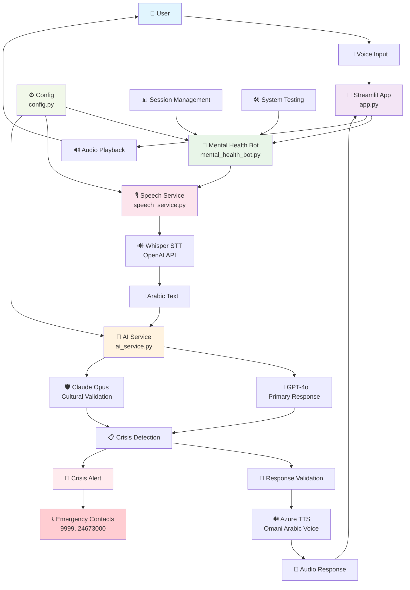

```mermaid
graph TB
    A[👤 User] --> B[🎤 Voice Input]
    B --> C[📱 Streamlit App<br/>app.py]
    C --> D[🧠 Mental Health Bot<br/>mental_health_bot.py]
    
    D --> E[🎙️ Speech Service<br/>speech_service.py]
    E --> F[🔊 Whisper STT<br/>OpenAI API]
    F --> G[📝 Arabic Text]
    
    G --> H[🤖 AI Service<br/>ai_service.py]
    H --> I[🧭 GPT-4o<br/>Primary Response]
    H --> J[🛡️ Claude Opus<br/>Cultural Validation]
    
    K[⚙️ Config<br/>config.py] --> D
    K --> E
    K --> H
    
    I --> L[📋 Crisis Detection]
    J --> L
    L --> M[🔄 Response Validation]
    
    M --> N[🔊 Azure TTS<br/>Omani Arabic Voice]
    N --> O[🎵 Audio Response]
    O --> C
    C --> P[🔊 Audio Playback]
    P --> A
    
    Q[🚨 Crisis Alert] --> R[📞 Emergency Contacts<br/>9999, 24673000]
    L --> Q
    
    S[📊 Session Management] --> D
    T[🛠️ System Testing] --> D
    
    style A fill:#e1f5fe
    style C fill:#f3e5f5
    style D fill:#e8f5e8
    style H fill:#fff3e0
    style E fill:#fce4ec
    style K fill:#f1f8e9
    style Q fill:#ffebee
    style R fill:#ffcdd2
```
